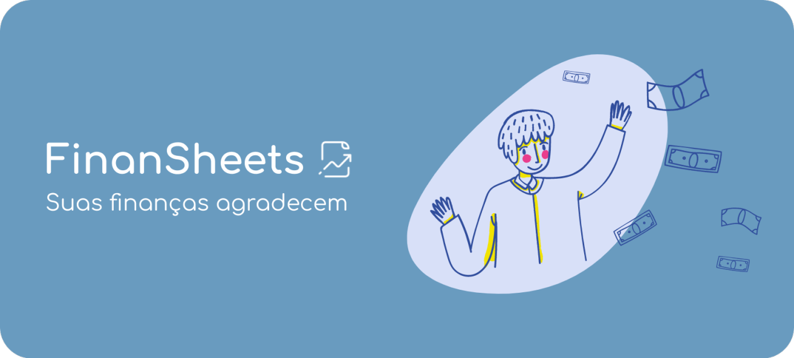
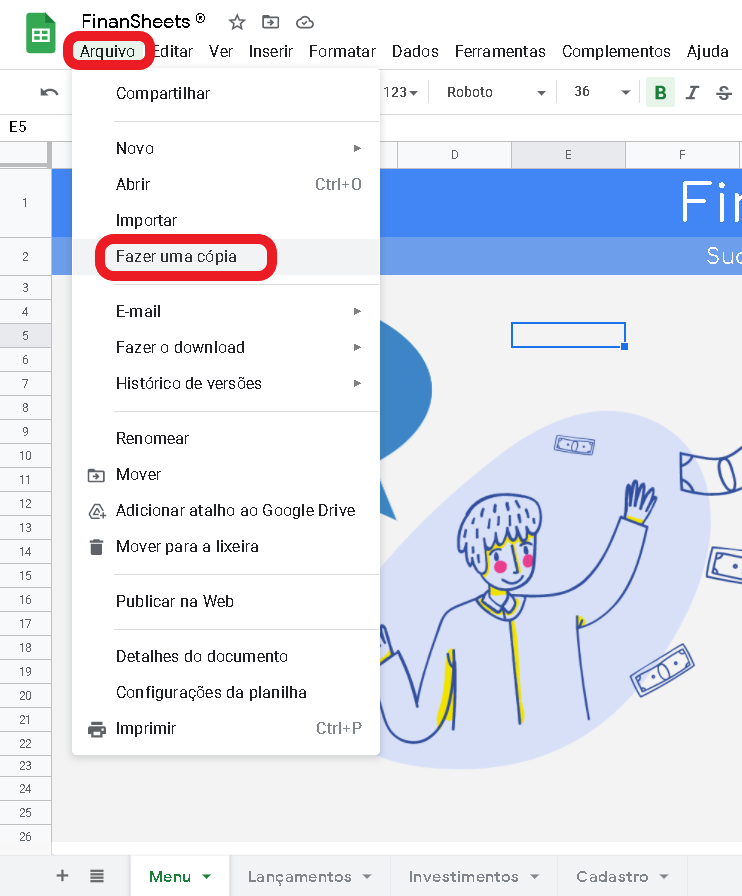
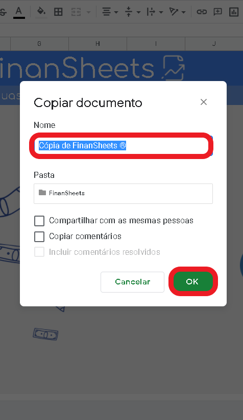

  
 

    

<h4 align="center"> 
	🚧  FinanSheets® 📊 Concluído 🚀 🚧
</h4>

 <a href="#-sobre-a-planilha">Sobre</a> •
 <a href="#-sobre-o-scrum">Sobre o Scrum</a> •
 <a href="#-funcionalidades">Funcionalidades</a> •
 <a href="#-layout">Layout</a> •
 <a href="#-como-usar-finansheets">Como Usar</a> • 
 <a href="#-tecnologias">Tecnologias</a> • 
 <a href="#-contribuidores">Contribuidores</a> •
 <a href="#user-content--licença">Licença</a>

## 💻 Sobre a planilha

📊 FinanSheets® - é uma forma das pessoas organizarem suas rotinas financeiras por meio de uma planilha simples, intuitiva e multifuncional. Dessa forma, ela tem o objetivo de dar suporte para o controle de gastos e custos, bem como da visibilidade do histórico financeiro do usuário, por meio de gráficos e índices percentuais conforme a sua configuração.

## 📋 Sobre o projeto
Projeto desenvolvido no curso de Engenharia de Software durante a cadeira de **Processos de Software**, o projeto tinha como finalidade aplicar conceitos de metodologias agéis no contexto de desenvolvimento de software. Ademais, usamos o framework **Scrum** como base de nosso processo de desenvolvimento, usando os conceitos fundamentais para obter o resultado de acordo com a necessidade do projeto.

## 🔄 Sobre o Scrum
O Scrum é um framework, focada em gerenciar equipes na produção, manutenção e entrega de produtos complexos e adaptativos.
O framework Scrum consiste de times Scrum associados a papéis, eventos, artefatos e regras. Dessa forma, cada componente dentro do framework serve a um propósito específico e é essencial para o uso e sucesso do Scrum.
Ademais, o Scrum emprega uma abordagem iterativa e incremental para aperfeiçar a previsibilidade e o controle de riscos. 

Para conhecer melhor o processo de desenvolvimento através do framework scrum, você pode acessar o [scrum guide](https://scrumguides.org/). Caso queira saber os príncipios para o desenvolvimento ágil, você pode acessar o [manifesto para desenvolvimento ágil de software](http://agilemanifesto.org/iso/ptbr/manifesto.html).

---

## ⚙️ Funcionalidades

- [x] Os usuários podem usar o **FinanSheets** no navegador, através do Google Sheets. Para saber mais sobre o Google Sheets, clique [aqui](https://www.google.com/intl/en-GB/sheets/about/)
- [x] **FinanSheets** permite aos usuários cadastrar seus lançamentos conforme a data, tipo (entrada/saída) e categoria. Na aba de lançamentos temos essas seguintes funções:
    - [x] O usuário poderá visualizar informações fornecidas pelo sistema como teto, ganhos e gastos totais, bem como o ganho liquido, com base nos seus laçamentos  
    - [x] O usuário poderá indicar um teto de gastos para que ele controle seus gastos.
    - [x] O usuário poderá filtrar seus laçamentos por quanto ao tempo (mês/ano) e por caracteristica (categoria/tipo).
    - [x] O usuário poderá observar gráficos para lhe auxiliar no processo de administração, sendo eles: Gráfico de divisão de gastos, divisão dos ganhos, comparação entre entrada e saída e  comparação entre o teto e a saída. 
- [x] **FinanSheets** permite aos usuários cadastrar seus investimentos conforme data, tipo (investimento/aposentatoria) e categoria (bens, renda fixa e variável).
    - [x] O usuário poderá ver o total investido em renda fixa, ativos reais e na sua aposentadoria, bem como observar sua carteira de investimento.  
    - [x] O usuário poderá novamente filtrar  seus investimentos quanto ao tempo (mês,ano) e por características (categoria/tipo).
    - [x] O usuário poderá ver gráficos que lhe auxiliarão no processo de investimento, sendo eles: Investimento por tipo, por categoria, por mês e ano.
---

## 🎨 Layout
teste

---

## 🚀 Como usar o FinanSheets®

Este projeto está hospedado no Google Sheet, você pode obter mais informações acessando 👉 [Saiba mais](https://www.google.com/intl/en-GB/sheets/about/).

### Pré-requisitos

Antes de começar, você precisa ter uma conta google para fazer login, depois disso você pode fazer uma copia gratuita da planilha para seu drive.

### Fazendo a copia
Um passo a passo simples, você pode ir seguindo as imganes abaixo:

  

  
   Depois basta salvar em uma pasta em seu drive.

  

  
---

## 🛠 Tecnologias

As seguintes ferramentas foram usadas na construção do projeto:

- [Google Sheets](https://www.google.com/intl/en-GB/sheets/about/)
- [Javascript](https://developer.mozilla.org/pt-BR/docs/Web/JavaScript)
- [ScrumHalf](https://myscrumhalf.com/)

#### **Utilitários**

-   Editor:  **[OverLeaf](https://pt.overleaf.com/)**
-   Markdown:  **[HackMD](https://hackmd.io/s/features)**,  **[Markdown Emoji](https://gist.github.com/rxaviers/7360908)**
-   Ícones:  **[Flaticon](https://www.flaticon.com/)**
-   Fontes:  **[Comfortaa](https://fonts.google.com/specimen/Comfortaa?query=com)**,  **[Arial](https://www.fonts.com/font/monotype/arial?QueryFontType=Web&src=GoogleWebFonts)**

---

## 👨‍💻 Contribuidores

💜 Um super thanks 👏 para essa galera que desenvolveu esse projeto incrível.

<table>
  <tr>
    <td align="center"><a href="https://github.com/CarlosHenryck"> <b>Carlos Henryck</b></a>   Scrum time 
    <td align="center"><a href="https://github.com/aSTRonuun"> <b>Vitor Alves</b></a>  Scrum time 
    <td align="center"><a href="https://github.com/davirxavier"> <b>Davi Xavier</b></a>  Product Owner 
</td>
    <td align="center"> <b>João Elias</b>  Scrum master 
</td>
    
  </tr>
</table>

---

## 📝 Licença

Este projeto esta sobe a licença [MIT](./LICENSE).

Feito com 💜 por [Vitor Alves](https://www.linkedin.com/in/vitor-alves-a089ab200/) e Carlos Henryck  👋🏽 Entre em contato!

---
